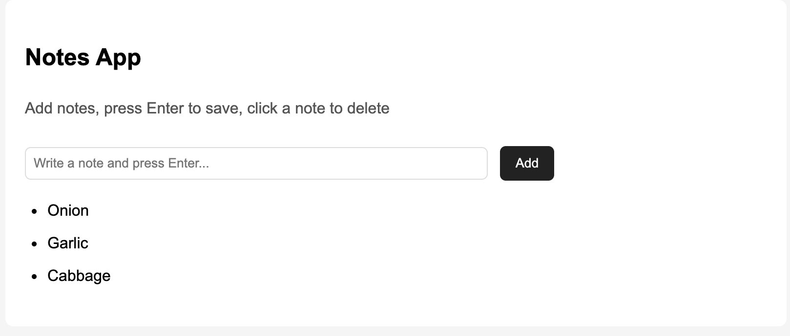

# Full-Stack Journey

This repository documents my journey to become a full-stack developer
by practicing **1.5 hour per day**.

## Project 1: Notes App (HTML, CSS, JavaScript)

A simple notes application built with vanilla JavaScript.

### Features
- Add notes with button or Enter key
- Delete notes by clicking
- Persistent storage using LocalStorage
- Responsive and clean UI

### What I learned
- DOM manipulation
- Event handling
- LocalStorage data persistence
- State synchronization between UI and storage

  

## Day 1
- Created my first HTML page
- Learned basic semantic HTML
- Built header, sections, and footer

## Day 2
- Added CSS styling to improve page layout
- Centered content using max-width and margin auto
- Styled header, sections, and footer
- Learned basic Flexbox for header alignment

## Day 3
- Added JavaScript file and linked it to HTML
- Created a button with a click event
- Verified JavaScript works by triggering an alert

## Day 4
- Used JavaScript to change text content on the page
- Learned variables, event listeners, and DOM manipulation
- Connected button interaction to UI updates

## Day 5
- Built a mini project status toggler
- Implemented state logic using a variable
- Cycled project status text through multiple states

## Day 6
- Added a projects list section
- Improved spacing for readability
- Prepared project for GitHub updates

## Day 7
- Restructured project folders into css / js / assets
- Updated HTML paths for linked files
- Practiced proper project organization and Git commits

## Day 8
- Built a Notes mini-app with input, button, and dynamic list rendering
- Practiced creating and appending DOM elements using JavaScript

## Day 9
- Added LocalStorage to persist notes after page refresh
- Implemented loading and saving of browser-stored data

## Day 10
- Enabled Enter key to add new notes
- Implemented click-to-delete functionality for notes
- Synced note updates with LocalStorage

## Day 11
- Polished Notes App UI text for a more professional feel
- Documented Notes App as Project 1 in README (features + what I learned)
- Added a project screenshot to assets and linked it in README
- Committed and pushed updates to GitHub

## Day 12
- Set up local development environment
- Verified Git, Node, and npm availability
- Cloned portfolio repository on work laptop

## Day 13
- Created my first React app using create-react-app
- Successfully ran the React development server with npm start
- Edited App.js to display custom content
- Verified live reload updates in the browser

